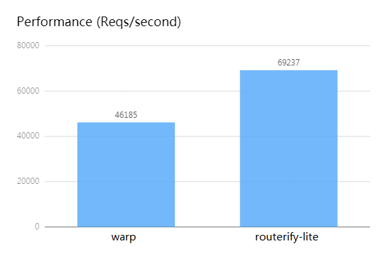
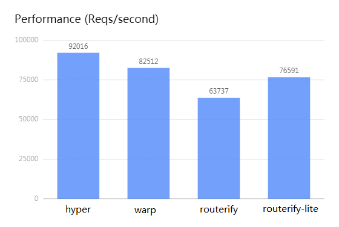
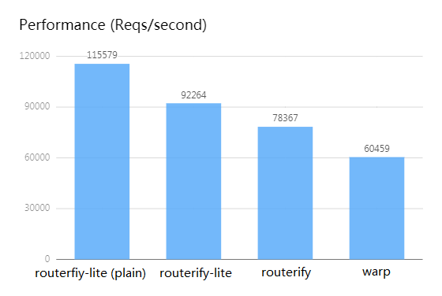

# Routerify lite

Routerify-lite is a simplified but faster version of [Routerify](https://github.com/routerify/routerify).

It only provides the below functions:
* path matching (including `:param` segment captures)

The path matching could be backed by RegexSet or HashMap.
If your matching pattern is a regular expression, then use RegexSet. Otherwise, HashMap is the best choice.

* error handling

The error handler would translate the request into a response in case of an error from the route handler.

Check the examples here: [examples](./examples)

## Why not Routerify?

Routerify is an excellent lib! But sometimes it performs not so well.
So I rewrite some code paths to improve performance.
If you need the full functions, you must use Routerify.

## Why not warp?

Warp is fast. But due to its linear scan path matching,
it would be as slow as the number of API combination increase.
However, Routerify uses RegexSet, which could match the URI path towards the pattern list in one scan.

For example, I add 50 random URIs to match, then routerify-lite is better than warp.

Check the code here:

https://gist.github.com/kingluo/8ccd88b53e9d2878391dbb91ad1f4751

`wrk -t2 -c100 -d60s http://test1:8080/hello/world`

## Performance

### Performance 1

`wrk -t2 -c100 -d60s http://test1:8080`

Check the code here:

https://gist.github.com/kingluo/73592448153fcc0e48788a5f9080b3bd

### Performance 2

Routerify-lite uses plain mode; 50 URI patterns.

`wrk -t2 -c100 -d60s http://test1:8080`

You could see that both plain and regex are better than linear scan.

## Difference between Routerify and Routerify-lite

* Routerify uses `*` to match anything, while Routerify-lite uses `.*`
* Routerify-lite has plain mode
